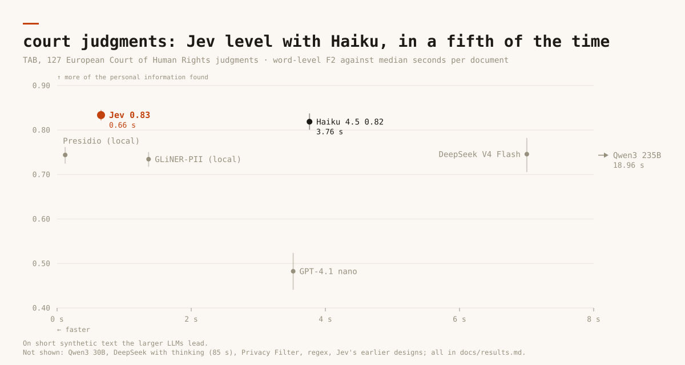
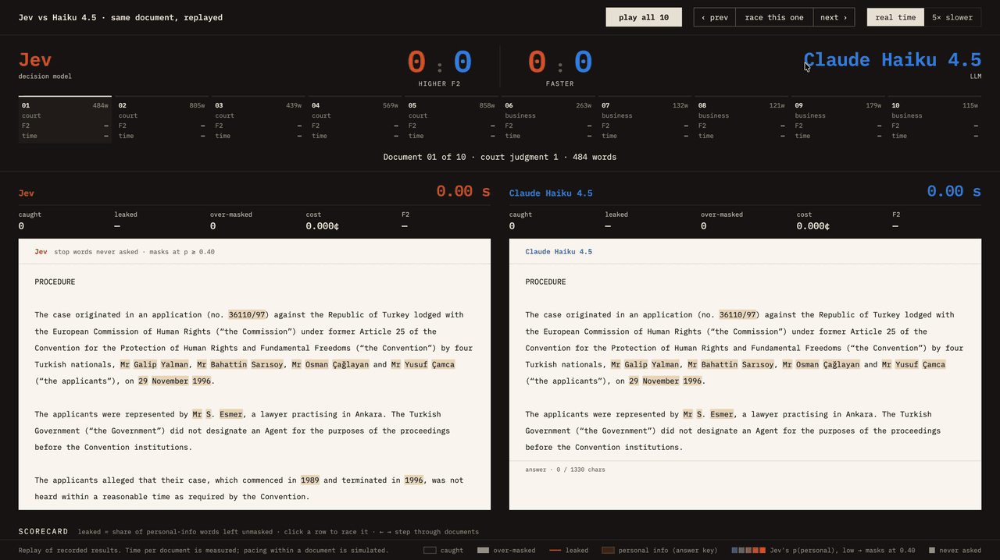
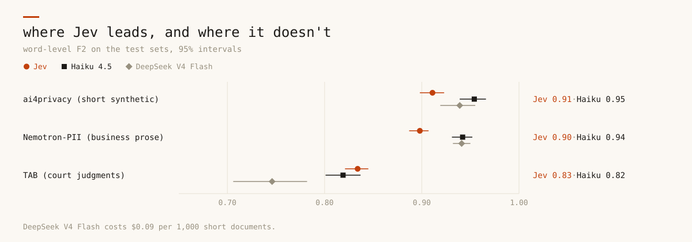
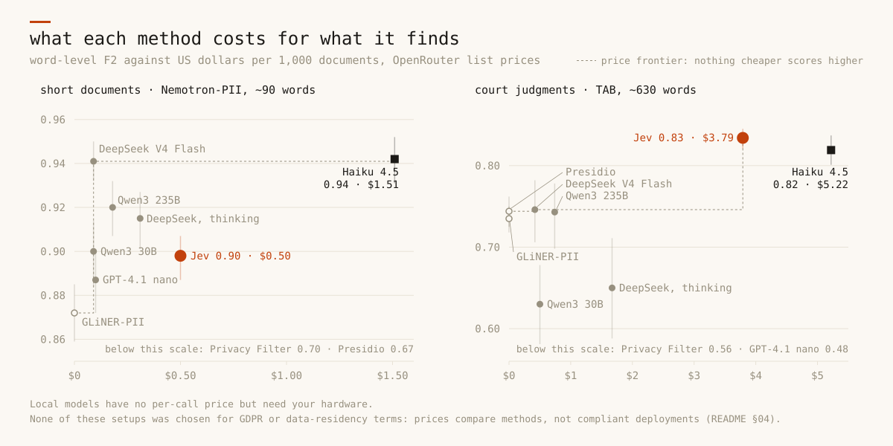
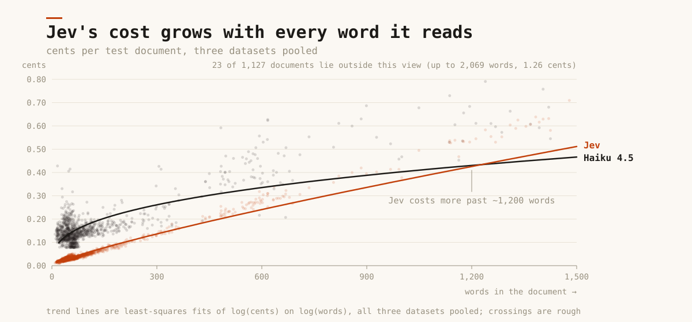
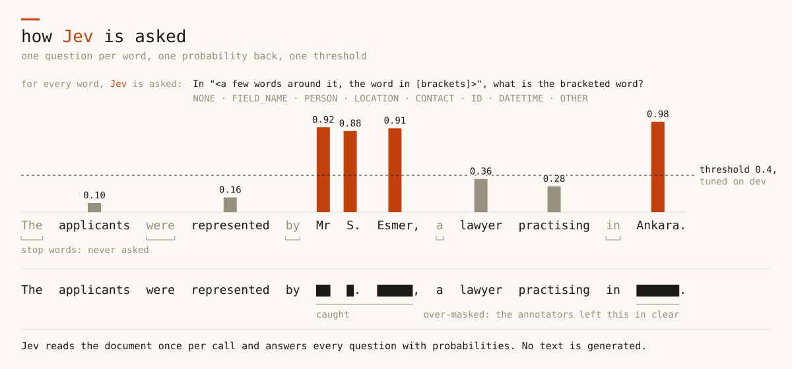

# jev-vs-pii

How good is [Jev](https://docs.typesafe.ai), a decision model, at finding personal
information in text, next to the tools used today and to current LLMs?

**Short answer.** On court judgments, where context decides what identifies someone, Jev
ties Claude Haiku 4.5 for the best score, runs about five times faster, costs about three
quarters as much, and lets the least personal information through: 11% stays unmasked,
against 17% for Haiku. On short synthetic text the larger LLMs stay ahead.

**What this project found**

→ **A decision model can match a strong LLM where anonymisation is hard.** On European Court of Human Rights judgments Jev scores as well as Haiku (F2 0.83 against 0.82), finds 81% of the details that identify someone only through context (a relative, an employer, a town), and answers in 0.7 s against 3.8 s.

→ **How you ask matters as much as which model you ask.** Jev first masked "Account" in "Account number: 4417…", because the question asked what each word *is*. One extra answer option, "the name of a kind of information", took it from 0.84 to 0.91 F2 on synthetic text. A reworded prompt took Haiku from 0.77 to 0.82 on judgments. Each change was picked on a separate dev set before the test run (§05).

→ **The right method depends on what you need to catch.** A fixed list of formats (emails, phone numbers, IDs) is cheap and fast with a local model. A policy like "anything that could re-identify this person" needs a model that reads instructions, Jev or an LLM, and then the scope you write is what it finds (§03).

→ **Usable today? Not yet, but soon.** Every paid method here sends the text to a third-party API through OpenRouter, and none was chosen for GDPR or data-residency terms. OpenAI announced its own decision model in September 2026. Once a provider releases one as open weights, or runs it under a GDPR-compliant contract, a decision model becomes a real option for anonymisation, depending on the scope (§04).

**What this is, and isn't.** A comparison of approaches, not a shortlist. The models here
stand in for each kind of method: a decision model, LLMs from small to large, and the usual
local tools, all run the same way on the same data so they can be compared on equal terms.
They are not the models to put on real personal data. A production solution depends on its
scope, budget and hardware, and on which GDPR-compliant decision models and LLMs exist when
it is built; it would be designed around those, with its own checks. That is doable today;
this repo shows how the approaches compare, not which product to pick.

Every method runs alone on the same gold data from three datasets (500 synthetic texts,
500 business documents, 127 court judgments) and is scored on accuracy, leaks,
calibration, cost and latency. Total spend for everything in this repo: $11.83.

<br>

**Score against speed, on court judgments**



<br>

**Watch them work**



A replay of Jev and Haiku reading the same documents, built from their recorded answers
and timed in real time. Jev's highlight sweeps word by word as its probabilities come
back; Haiku's answer streams in as it writes; every word lights up as caught, leaked or
over-masked. [The race page](https://alanviollier.github.io/jev-vs-pii/race/) lets you
pick a document, slow it down five times, and read each document's numbers. These ten (the
first five test documents of TAB and of Nemotron-PII) favour Haiku on F2, 8 to 2; over
every test document, Jev scores higher on 73 of 127 judgments and Haiku on 371 of 500
business documents.

<br>

**Score on all three datasets**



<br>

**What gets through:** the share of the personal information left unmasked.

| | ai4privacy | Nemotron-PII | TAB |
|---|---|---|---|
| Jev | 6.7% | **5.0%** | **11.3%** |
| Claude Haiku 4.5 | **3.0%** | 6.3% | 16.9% |
| DeepSeek V4 Flash | 4.1% | 5.9% | 26.3% |
| GLiNER-PII (local) | 6.1% | 13.3% | 20.9% |

Jev catches a lot and masks more around it. Some of what it is marked wrong for is
arguably personal (a city, "born" next to a birth date), and some of what counts as a leak
is a labelling convention: these datasets set the ceiling as much as the models do. Every
method's numbers are in §01, the details in §02 and §03.

<br>

## 01 · Results

### Score: how much of the personal information each method finds

Word-level F2 on the test sets: finding personal information counts four times as much as
not over-masking (§07). Best in each column in bold.

| method | ai4privacy | Nemotron-PII | TAB | TAB F1 |
|---|---|---|---|---|
| Jev | 0.911 | 0.898 | **0.834** | 0.765 |
| Claude Haiku 4.5 | **0.954** | **0.942** | 0.819 | **0.802** |
| Qwen3 235B | 0.946 | 0.920 | 0.743 | 0.733 |
| DeepSeek V4 Flash | 0.939 | 0.941 | 0.746 | 0.760 |
| DeepSeek V4 Flash, thinking | 0.940 | 0.915 | 0.650 | 0.696 |
| Qwen3 30B | 0.907 | 0.900 | 0.630 | 0.627 |
| GPT-4.1 nano | 0.816 | 0.887 | 0.483 | 0.416 |
| GLiNER-PII (local) | 0.841 | 0.872 † | 0.735 | 0.663 |
| Privacy Filter (local) | 0.862 | 0.698 | 0.555 | 0.654 |
| Presidio (local) | 0.587 | 0.671 | 0.744 | 0.762 |
| regex | 0.539 | 0.433 | 0.505 | 0.614 |
| mask every word (the floor) | 0.510 | 0.358 | 0.405 | 0.214 |

Jev is shown with its final question design; the earlier designs and what each change did
are in §05. † GLiNER-PII was trained on Nemotron-PII's train split.

### What gets through: personal information left unmasked

The share of personal-information words each method left unmasked. Lower is better.

| method | ai4privacy | Nemotron-PII | TAB |
|---|---|---|---|
| Jev | 6.7% | **5.0%** | **11.3%** |
| Claude Haiku 4.5 | **3.0%** | 6.3% | 16.9% |
| Qwen3 235B | 3.4% | 7.8% | 24.9% |
| DeepSeek V4 Flash | 4.1% | 5.9% | 26.3% |
| DeepSeek V4 Flash, thinking | 4.4% | 9.3% | 37.7% |
| Qwen3 30B | 3.9% | 7.2% | 36.8% |
| GPT-4.1 nano | 19.3% | 11.5% | 46.0% |
| GLiNER-PII (local) | 6.1% | 13.3% | 20.9% |
| Privacy Filter (local) | 14.3% | 34.3% | 49.5% |
| Presidio (local) | 45.1% | 36.8% | 26.7% |
| regex | 51.3% | 62.1% | 54.9% |

### Documents with no personal information left

The share of documents in which every personal-information word was masked. Higher is
better.

| method | ai4privacy | Nemotron-PII | TAB |
|---|---|---|---|
| Jev | 67% | **80%** | 8% |
| Claude Haiku 4.5 | 90% | 76% | 5% |
| Qwen3 235B | 88% | 72% | 3% |
| DeepSeek V4 Flash | **91%** | 75% | 2% |
| DeepSeek V4 Flash, thinking | 88% | 67% | 6% |
| Qwen3 30B | **91%** | 73% | 2% |
| GPT-4.1 nano | 67% | 62% | 15% |
| GLiNER-PII (local) | 79% | 43% | 0% |
| Privacy Filter (local) | 50% | 24% | 0% |
| Presidio (local) | 15% | 11% | 0% |
| regex | 18% | 4% | 0% |

A court judgment runs to about 600 words, so one missed detail is enough to leave it
unclean: almost none come out fully masked, for any method.

None of these numbers is absolute. The labels are one team's reading of what counts as
personal: some of what Jev and the others are marked wrong for is arguably personal (a
city, "born" next to a birth date), and some of what counts as a leak is a labelling
convention ("and" inside a court's name, cookie flags). More in §03.

### Cost and speed

Per document, on short text (Nemotron-PII, ~90 words) and long text (TAB, ~630 words).

| method | $ per 1k docs, short | $ per 1k docs, long | median s per doc, short | median s per doc, long |
|---|---|---|---|---|
| Jev | 0.50 | 3.79 | 0.47 | 0.66 |
| Claude Haiku 4.5 | 1.51 | 5.22 | 1.8 | 3.8 |
| Qwen3 235B | 0.18 | 0.74 | 14 | 19 |
| DeepSeek V4 Flash | 0.09 | 0.42 | 2.1 | 7.0 |
| DeepSeek V4 Flash, thinking | 0.31 | 1.67 | 9.2 | 85 |
| Qwen3 30B | 0.09 | 0.50 | 3.2 | 21 |
| GPT-4.1 nano | 0.10 | 0.35 | 1.5 | 3.5 |
| local models (Presidio, Privacy Filter, GLiNER-PII) | 0 | 0 | 0.02 – 1.8 | 0.1 – 2.3 |

### Price against score



Every table behind these (confidence intervals, precision and recall, recall by type,
calibration, paired tests, the strings each method leaks): [`docs/results.md`](docs/results.md).
Chart-ready numbers: [`docs/data/`](docs/data).

## 02 · Questions a skeptic would ask

### About the result

**Is the tie on court judgments real, or noise?** It's a tie. On the same 127
judgments, Jev minus Haiku is +0.015 F2, with a 95% paired interval of −0.002 to +0.032.
Every other method is clearly behind Jev there, by 0.09 to 0.35, each interval clear of
zero.

**Why does Jev win on judgments and lose on short text?** It finds more and masks more
around it. On judgments its recall is 0.89 against Haiku's 0.83, and it finds 81% of the
details that identify someone only through context (Haiku 73%); its precision is 0.67
against 0.77. Judgments reward finding context. Short synthetic text is full of easy,
well-formatted values, where over-masking decides the score: Jev's precision there is
0.74 to 0.83 against Haiku's 0.89 to 0.96. What it still over-masks most: "applicant",
"born", and a few field names it takes for values ("number", "date").

**Is it cheaper or faster?** Faster, always: 0.5 s against Haiku's 1.8 s on short
documents, 0.7 s against 3.8 s on judgments. Cheaper, up to a point: Jev bills only what it
reads, but asks one question per word, so its cost grows with length. It costs a third of
Haiku on short documents ($0.50 against $1.51 per 1,000) and about three quarters on
judgments ($3.79 against $5.22); on these datasets it passes Haiku at about 1,200 words.



Asking about fewer words is the lever. Skipping common words like "the" and "his" nearly
halved Jev's cost on judgments ($5.76 to $3.12 per 1,000, before the field-name option was
added) and raised its score. The skip here is the simplest version, a fixed word list; a
smarter choice of which words to ask about, such as a cheap first pass that flags the
candidates, would likely cut cost and over-masking further.

**Can you trust its output?** Every Jev call returned a probability for every question (one
call failed once and went through on retry), and those probabilities are well calibrated:
expected calibration error 0.04 to 0.08, as good as the local models. The LLMs failed on
up to 13 of 127 judgments, by looping or running out of tokens, and each failure counts as
finding nothing.

### About the method

**Did you tweak Jev until it won?** Its question design did change after the first run,
and so did the LLMs' prompt; that is how the numbers got right. The first full run had three problems that only its errors showed:
Jev masked field names like "Account number", the stop-word skip also skipped "May", "US"
and number words, and LLM answers written with straight quotes didn't match the curly
quotes in the judgments. Each fix, and a reworded LLM prompt, was checked on a separate
20-document dev set before the test set was run again; §05 has every step's scores. The
dev run now lists every method's most leaked and over-masked words, so problems like
these show up before a full run.

**Jev gets a threshold and the LLMs don't. Is that fair?** The threshold is picked on the
20 dev documents per dataset, never on test. A probability you can set a threshold on is part of
what Jev offers; an LLM gives one answer, and changing its trade-off means rewording the
prompt.

**Why F2 and not F1?** For anonymisation, a leaked name costs more than an over-masked
word. F1 sits next to F2 in §01, and on it Haiku leads on judgments (0.80 against 0.77).

**How sure are these numbers?** 500, 500 and 127 test documents. 95% intervals come from
resampling whole documents, and "A beats B" claims use paired intervals on the same
documents. Each method ran once at temperature 0; OpenRouter picks the serving provider
per call, which can shift LLM results between runs.

### About everyone else

**What does every method miss?** Details that identify someone only through context: the
employer ("Serco"), a court that names the town ("Będzin District Court"), what the case
is about ("widows"). The most leaked and most over-masked words per method are in
[`docs/results.md`](docs/results.md).

**Do model size, reasoning or the prompt matter for the LLMs?** Size does where context
matters: Qwen3 235B over 30B is +0.04 and +0.02 F2 on the synthetic sets, +0.11 on
judgments. Reasoning doesn't: DeepSeek V4 Flash with thinking on scored the same or lower,
never finished 13 judgments, and took 12 times as long. The prompt does a lot: the
datasets' own guidelines instead of a one-line definition took Qwen3 235B from 0.53 to
0.78 on judgments in the dev run, and the exact-copy prompt took Haiku from 0.77 to 0.82.

### Practical

**Why no GPT-5, Claude Sonnet or Gemini Pro?** Budget: everything here cost $11.83. Haiku
is the strong reference, and any model on OpenRouter is one entry in `config.yaml` and a
rerun away.

**Can I rerun it?** `make bench`, about $7.40 of OpenRouter calls and 1 to 2 hours. Every
response is cached by request, so a rerun of finished work is free (§08).

**Can I use one of these on real personal data?** Not the way they ran here. Every paid
method went through a third-party API with no GDPR or data-residency terms, so none of
these setups should see real personal data. A production system would need a compliant
provider or a model you host, plus a pipeline built for your own scope, data and review
process. This repo compares the approaches on equal terms; §03 lists what decides
between them.

## 03 · Which approach fits which job

No method wins everywhere. What fits depends on what you need to catch, how much text,
and where it may go:

| if you need | what fits | what this benchmark shows |
|---|---|---|
| a fixed list of formats (emails, phone numbers, IDs), at high volume, without the text leaving your machine | a local model (GLiNER-PII, Presidio) | free per call and fast (0.02 to 2.3 s), but they miss what only context reveals: 21% to 27% of the personal information in judgments gets through |
| a policy, like "anything that could re-identify this person", on long documents | a decision model or a strong LLM | both read the guidelines as text; Jev lets 11% through against Haiku's 17%, five times faster |
| few false alarms on short, structured text | a strong LLM | precision 0.89 to 0.96 for Haiku; DeepSeek V4 Flash gets close at $0.09 per 1,000 documents |
| a dial between leaking and over-masking | a method that scores each word (Jev, GLiNER-PII, Privacy Filter) | move one threshold; an LLM's trade-off only moves by rewording its prompt |
| an answer for every document | a local model or a decision model | Jev answered every question; the LLMs failed on up to 13 of 127 judgments (loops, cut-offs) |
| a scope that changes per client or document type | anything that reads instructions (Jev, an LLM) | editing the guidelines moved Qwen3 235B from 0.53 to 0.78 F2 on judgments; a local model needs new labels or retraining |

Whichever fits, real personal data needs a model you host or one run under a contract that
allows it; none of the setups here was chosen for that.

The labels are one team's reading of a policy too. Two human experts labelling the same
judgments reach only 0.86 F2 against each other, and some of what every method is marked
wrong for (a city the policy leaves visible, "and" inside a court's name, cookie flags in
Nemotron-PII) is a convention you might not share. Scored against your own definition,
every number here would move.

## 04 · Why test Jev

Jev is a model from TypeSafe, served through OpenRouter's
[Decisions API](https://openrouter.ai/docs/guides/community/jev). It doesn't write text.
You send it a state and typed questions (yes/no, or pick one of a few options), and it
answers each one with probabilities. Output is free; you pay for input tokens.

PII detection fits that shape: it is one question per word ("is this personal
information?"), and what you want back is a probability you can put a threshold on, not
prose to parse.



Decision models became a category while this was being built: OpenAI announced a
Decisions API in limited preview on September 29, 2026, and Fastino's API-only GLiDE
followed on October 1. Both came out too late for this run. A decision model that takes a
state and typed questions is one `DecisionModel` class away (`lanes/decision.py`), and
every question design runs on it unchanged.

## 05 · Methods

| family | lanes | output |
|---|---|---|
| reference | `mask_all` (the floor) · `human` (TAB's second annotator against the first) | spans |
| rules | `regex`: emails, phones, IPs, card and ID numbers, dates, times | spans |
| NER and small PII models, local | `presidio` (spaCy `en_core_web_lg`) · `privacy_filter` (OpenAI, 1.5B MoE, 50M active) · `gliner_pii` (NVIDIA, 570M) | spans, and a probability per word for the last two |
| Jev (decision model) | `decision_<design>:jev`, by question design: `words`, one yes/no per word · `typed`, one choice per word (none, or a type) · `typed_skip`, `typed` minus stop words · `fields`, `typed` plus a "name of a kind of information" option · `fields_skip`, both · `bio`, yes/no plus "same item as the word before?" | a probability per word |
| LLMs, via OpenRouter | `llm_sayback:<model>`: list the PII strings, code finds them in the text · `llm_offsets`: character offsets · `llm_tagged`: rewrite the text with tags | spans |

→ **Lanes that read instructions get the same brief** (Jev and the LLMs): the dataset's own annotation guidelines (ai4privacy's and Nemotron-PII's label lists, TAB's published guidelines), then the six types to answer in (`taxonomy.definition`). Regex, Presidio and Privacy Filter run as shipped; GLiNER-PII gets a fixed list of label names.

→ **Jev** gets the whole document once as its state and one question per word, with the word bracketed in a few words of context. Questions are packed into as few calls as fit. Jev's docs give a 32k-token context; calls are packed up to an estimated 48k because larger calls were accepted. Counted in billed tokens, the typed designs went past 32k, mostly on TAB. There, `decision_typed:jev` and `decision_fields_skip:jev` answer slightly worse past 32k (Brier 0.073 against 0.068, and 0.077 against 0.072, on a similar share of PII) and `decision_typed_skip:jev` doesn't (`docs/results.md`, last section).

→ **Per-word scores become spans through a threshold tuned on dev** (word-level F2, never on test), for every lane that scores words. Three structured decoders (hysteresis, gap closing, Viterbi) were tuned the same way and are reported beside it; on the dev pilot none beat the threshold by more than about 0.02 F2.

→ **Privacy Filter**'s own spans come from OpenAI's constrained Viterbi (`opf` package) at its default operating point and match OpenAI's reference runtime; they are in the decoder table. Its headline row uses the tuned threshold on its per-word probability, like the other scorers. That threshold lands at 0.001, the bottom of the grid: at F2 it pays to mask anything the model gives any weight to.

→ **GLiNER-PII** returns candidates down to a 0.05 score; its card default is 0.5. Long documents run in windows sized to its 384-token limit, overlapping by 50 words.

→ **LLMs** run at temperature 0 under a strict JSON schema where the format has one, with an 8k output cap. The sayback prompt asks for every string copied exactly, never reformatted or merged, with titles kept on names, names given in full, and single-word details included. An answer that is cut off or won't parse counts as finding nothing, and the reason is recorded. Strings are matched to the text ignoring case, spacing, and straight vs curly quotes.

→ **Reasoning** is tested on one model, DeepSeek V4 Flash, with thinking off and on, on the same fp8 providers so nothing else changes. Thinking gets an extra 8k tokens.

→ **Dev pilot only** (20 documents per dataset): `decision_bio:jev` (same score as `decision_words:jev` at twice the cost), `decision_fields:jev` (below `decision_fields_skip:jev` on every dataset), the offsets and tagged formats (offsets scored 0.00 on TAB; both loop to the output cap often enough that full test sets would take hours) and Llama 3.1 8B (loops under the strict schema on up to 60% of documents).

### How the designs evolved

Each change was picked on the dev pilot (20 documents per dataset), then run on test.
Word-level F2, ai4privacy · Nemotron-PII · TAB:

| Jev question design | what changed | dev | test |
|---|---|---|---|
| `words` | one yes/no per word | 0.88 · 0.75 · 0.69 | 0.84 · 0.72 · 0.68 |
| `typed` | one choice: none, or one of six types | 0.85 · 0.84 · 0.79 | 0.83 · 0.79 · 0.79 |
| `typed_skip` | stop words never asked; number words and "may", "am", "us", "ca" still asked | 0.86 · 0.87 · 0.82 | 0.84 · 0.83 · 0.82 |
| `fields` | `typed` plus "the name of a kind of information, not the information itself" | 0.95 · 0.91 · 0.80 | – |
| `fields_skip` | both changes | 0.95 · 0.92 · 0.84 | 0.91 · 0.90 · 0.83 |

The first version of the stop-word skip also skipped "May", "US" and number words; it
was fixed before the final run. The LLM prompt went from a one-line definition to each
dataset's guidelines, then to the exact-copy prompt above:

| LLM, test F2 before → after the exact-copy prompt | ai4privacy | Nemotron-PII | TAB |
|---|---|---|---|
| Claude Haiku 4.5 | 0.953 → 0.954 | 0.934 → 0.942 | 0.774 → 0.819 |
| Qwen3 235B | 0.952 → 0.946 | 0.912 → 0.920 | 0.722 → 0.743 |
| DeepSeek V4 Flash | 0.946 → 0.939 | 0.923 → 0.941 | 0.722 → 0.746 |
| DeepSeek V4 Flash, thinking | 0.948 → 0.940 | 0.864 → 0.915 | 0.667 → 0.650 |
| Qwen3 30B | 0.938 → 0.907 | 0.902 → 0.900 | 0.650 → 0.630 |
| GPT-4.1 nano | 0.826 → 0.816 | 0.837 → 0.887 | 0.480 → 0.483 |

One prompt for every model, chosen on its dev average (+0.018 F2), not per model.

| model key | OpenRouter id |
|---|---|
| `qwen3-30b` | `qwen/qwen3-30b-a3b-instruct-2507` |
| `qwen3-235b` | `qwen/qwen3-235b-a22b-2507` |
| `gpt4.1-nano` | `openai/gpt-4.1-nano` |
| `llama3-8b` | `meta-llama/llama-3.1-8b-instruct` (dev pilot only) |
| `deepseek-v4-flash` / `-think` | `deepseek/deepseek-v4-flash`, thinking off / on, DeepInfra · Parasail · Alibaba |
| `haiku4.5` | `anthropic/claude-haiku-4.5` |
| Jev | `typesafe/jev-1.13` (Decisions API) |

## 06 · Data

| | ai4privacy | Nemotron-PII | TAB |
|---|---|---|---|
| what | short synthetic texts, pii-masking-300k English files | synthetic business prose (letters, reports, notes), unstructured records only | European Court of Human Rights judgments |
| length | ~53 words | ~87 words | ~630 words (up to ~2,000) |
| test / dev | 500 / 500 sampled, seed 0 | 500 from the test file / 500 from the train file, seed 0 | 127 / 127, its own splits |
| gold | every personal detail, broadly (bare hours, sex, titles count) | 55 PII and sensitive categories | what must be masked so the applicant can't be re-identified; what can stay is marked too |
| licence | academic, non-commercial: downloaded at run time, never committed, text never shown | CC BY 4.0 | MIT |

All three map onto six coarse types (PERSON · LOCATION · CONTACT · ID · DATETIME · OTHER),
and every dataset label is tagged **format** (found by its form: emails, codes, dates,
amounts) or **context** (found by its meaning: names, places, organisations, personal
attributes). Nemotron-PII reuses some document ids for different documents; repeats get
their own id here. No public dataset of real everyday text (emails, chats) with PII
labels exists; all three sets are either synthetic or legal.

## 07 · Scoring

→ **Leaks**: the share of gold words left unmasked (1 − recall), and the share of documents with any gold word that came out with none left. A failed answer counts as leaking the whole document.

→ **Headline: word-level F2.** A word is gold if a gold span overlaps it, predicted if a predicted span does. F2 weights recall: a leak costs more than an over-mask. Word level credits masking street and city as one span, and counts a half-masked name as a leak.

→ **Format vs context**: recall on each kind of PII, and on TAB, how much of what the annotators left in clear a method masks anyway.

→ **Exact span match** next to it, the usual NER number.

→ **Recall by type and by each dataset's own labels**, precision by the type a method claims, and on TAB and Nemotron-PII the strings each method most often leaks or over-masks (ai4privacy's licence keeps its text out of the published results).

→ **Calibration** (ECE, Brier, reliability bins) for every method that gives a probability per word.

→ **Cost and time**: $ per 1k docs from each response's reported cost, calls and tokens per doc, latency mean / p50 / p95 per doc (for Jev, whose questions on a long doc go out as parallel calls, the slowest of them). Cached reruns report the original numbers. Local models run on an Apple M1 Pro (GPU where supported).

→ **Uncertainty**: 95% intervals by resampling whole documents, and paired intervals on the same documents for "is A really better than B".

→ **Two reference rows**: mask everything (the floor) and a second human expert who labelled the same judgments (TAB's second annotator, scored against the first: the ceiling, on the 105 judgments both labelled). F2 leans on recall hard enough that masking everything scores 0.36 to 0.51 depending on how dense the PII is, so read every row against its dataset's floor.

## 08 · Run it

```sh
uv sync --extra dev --extra ner      # ner: Presidio, spaCy model, torch, Privacy Filter, GLiNER-PII
cp .env.template .env                # add an OpenRouter key
uv run jev-vs-pii fetch              # datasets into data/, never committed
make bench-free                      # rules and local models on the three test sets: $0
make bench                           # everything: dev pilot, threshold tuning, full run, scores, docs/
```

Single lanes: `uv run jev-vs-pii run --lanes decision_words:jev,llm_sayback:qwen3-30b --dataset tab --tier smoke`
(tiers: smoke 2 docs · pilot 20 · full). Every paid call goes through one spend ledger with
a hard cap (`budget_cap_usd` in `config.yaml`) and a response cache, so a rerun costs
nothing. `jev-vs-pii export runs/test` rewrites `docs/results.md` and `docs/data/`.

## 09 · Layout

| path | what |
|---|---|
| `jev_vs_pii/lanes/` | one file per method; `decision.py` asks a decision model a question design from `designs.py` (Jev in `jev.py`), `llm_formats.py` holds the LLM answer formats |
| `jev_vs_pii/clients/` | the only code that calls an API: budget hold, retries, cache |
| `jev_vs_pii/taxonomy.py` | coarse types, format/context shapes, each dataset's guidelines |
| `jev_vs_pii/decode.py` | word scores → spans |
| `jev_vs_pii/align.py` | an LLM's answer → character offsets |
| `jev_vs_pii/metrics/` | word and exact scoring, calibration, bootstrap, cost, error strings, result rows |
| `jev_vs_pii/run/` | runner, tiers, store, threshold tuning |
| `jev_vs_pii/report/` | Markdown tables and the `docs/data/` export |
| `docs/` | every results table, and the numbers behind the charts |

## 10 · Limits

→ Not a deployment recommendation (§03). Models were chosen to fit a small budget, so no frontier-size LLM is in it, and none was chosen for GDPR terms.

→ English only, and no real everyday text: two synthetic sets and one legal one.

→ Public datasets may be in the models' training data. GLiNER-PII was trained on Nemotron-PII's train split: its test numbers come from the test file, but its tuned threshold was picked on dev, which samples train. Privacy Filter reports results on pii-masking-300k.

→ Thresholds are tuned on 20 dev docs per dataset.

→ One run per method at temperature 0. OpenRouter picks the serving provider per call (recorded with every answer), which can change behaviour between runs; only the reasoning pair is pinned.

→ Jev 1.13 is served from an alpha endpoint; its behaviour and prices may change.

→ Jev's question designs and the LLM prompt were revised after reading the first run's test errors; every revision was chosen on dev (§02, §05).

→ The typed designs' calls on TAB were packed past Jev's documented 32k context, where two of them answer slightly worse (§05). Packing to 32k would be the safe setting, at more calls per document.

→ TAB is scored against its first annotator.

→ Prices are OpenRouter list prices on the run date.

## Credits

ai4privacy pii-masking-300k by AI4Privacy. Nemotron-PII by NVIDIA (CC BY 4.0). TAB by
Pilán et al., *The Text Anonymization Benchmark (TAB)*, Computational Linguistics 2022.
OpenAI Privacy Filter (Apache 2.0) and NVIDIA GLiNER-PII.
